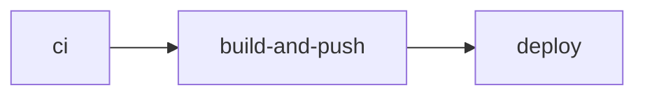
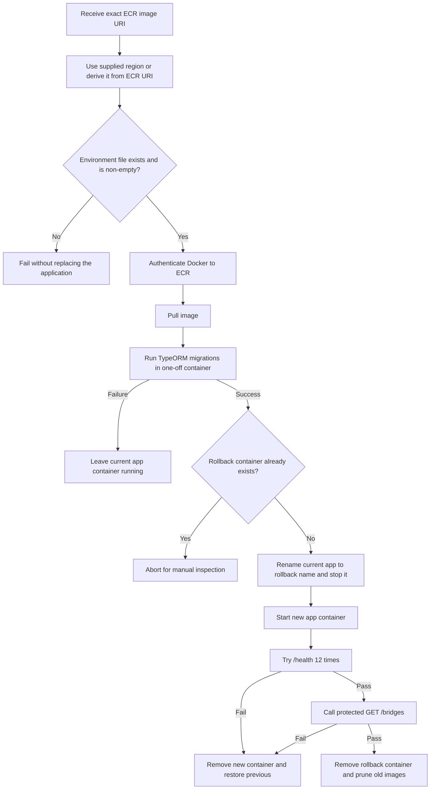

# Current CI/CD flow

This document describes how `puente-radar-api` currently moves a change from an issue to a deployed EC2 container. It covers repository and deployment mechanics only; product behavior and PR-specific review evidence are out of scope.

## At a glance

| Topic                  | Current state                                                                                          |
| ---------------------- | ------------------------------------------------------------------------------------------------------ |
| Default branch         | `main`                                                                                                 |
| Active delivery branch | `staging`                                                                                              |
| Pull request checks    | CI on PRs whose **target base** is `main`, `staging`, or `feat/historical-bridge-time-recommendations` |
| Delivery events        | Pushes to `staging` or `main`                                                                          |
| Quality gate           | Frozen install, lint, build, and unit tests                                                            |
| Artifact               | Multi-stage Node 20 Alpine image in Amazon ECR, tagged `<branch>-<full-sha>`                           |
| Deployment             | GitHub Actions sends an SSM Run Command to the selected EC2 instance                                   |
| Runtime validation     | Database-aware `/health`, then authenticated `GET /bridges`                                            |
| Application rollback   | Restore the previous Docker container if startup or smoke checks fail                                  |

```mermaid
flowchart LR
    Issue[Approved issue and labels] --> PR[Pull request]
    PR --> Commit[Candidate commit]
    Commit --> CI[CI checks]
    CI --> Merge[Merge to staging or main]
    Merge --> Image[ECR image: branch + SHA]
    Image --> SSM[SSM Run Command]
    SSM --> EC2[EC2 rollout]
    EC2 --> Verify[/health + protected /bridges]
```

The issue, PR, commit, workflow run, immutable image tag, SSM command, and target environment form the traceability chain. Issue-first metadata exists in GitHub through approved issues and status/type labels. The repository does not currently contain versioned issue templates, PR templates, or a workflow that enforces issue and label metadata.

## Event matrix

The checked-in trigger is defined in [`.github/workflows/ci-cd.yml`](../../.github/workflows/ci-cd.yml):

```yaml
on:
  push:
    branches: [main, staging]
  pull_request:
    branches: [main, staging, feat/historical-bridge-time-recommendations]
```

For `pull_request`, `branches` filters the PR's **target/base branch**, not its source/head branch. A PR from any source branch runs this workflow only when its base matches one of the three listed branches.

| Event          | Base or pushed branch                              |  CI | Build and push |     Deploy |
| -------------- | -------------------------------------------------- | --: | -------------: | ---------: |
| `pull_request` | Base `main`                                        | Yes |             No |         No |
| `pull_request` | Base `staging`                                     | Yes |             No |         No |
| `pull_request` | Base `feat/historical-bridge-time-recommendations` | Yes |             No |         No |
| `pull_request` | Any other base                                     |  No |             No |         No |
| `push`         | `staging`                                          | Yes |            Yes |    Staging |
| `push`         | `main`                                             | Yes |            Yes | Production |
| `push`         | Any other branch                                   |  No |             No |         No |

PR [#4](https://github.com/jdomenic-dev/puente-radar-api/pull/4) added the tracker target filter. The HBTR delivery strategy then changed to sequential PRs targeting `staging`, because a `pull_request` workflow must already be present on the default branch for GitHub Actions to enable it reliably. The extra feature-branch base filter remains in the current workflow, but HBTR delivery uses `staging` as the integration base.

## Job graph



| Job              | Dependency              | Event guard      | Effect                                |
| ---------------- | ----------------------- | ---------------- | ------------------------------------- |
| `ci`             | None                    | Workflow trigger | Validates the candidate revision      |
| `build-and-push` | `needs: ci`             | Push only        | Publishes the exact revision to ECR   |
| `deploy`         | `needs: build-and-push` | Push only        | Deploys that image to EC2 through SSM |

A PR therefore stops after CI. On a qualifying push, an image cannot be published unless CI succeeds, and deployment cannot start unless publication succeeds.

## CI gate

The `ci` job runs on `ubuntu-latest` with pnpm 9 and Node.js 20. It executes these commands in order:

```bash
pnpm install --frozen-lockfile
pnpm run lint
pnpm run build
pnpm run test --ci --coverage=false
```

The command definitions are in [`package.json`](../../package.json):

| Command                               | Effective operation                       | Important boundary                                       |
| ------------------------------------- | ----------------------------------------- | -------------------------------------------------------- |
| `pnpm install --frozen-lockfile`      | Install exactly from `pnpm-lock.yaml`     | Fails rather than rewriting an inconsistent lockfile     |
| `pnpm run lint`                       | ESLint over source and tests with `--fix` | It is a mutating fix command, not a check-only lint gate |
| `pnpm run build`                      | `nest build`                              | Proves TypeScript/Nest compilation                       |
| `pnpm run test --ci --coverage=false` | Jest unit test suite                      | Coverage is disabled                                     |

`pnpm run test:e2e` is **not** run. The workflow comments identify PostgreSQL as the missing E2E dependency, so database-backed application startup and migration behavior are not validated on every PR.

## Image build and identity

The [`Dockerfile`](../../Dockerfile) is a two-stage build:

1. `builder` uses `node:20-alpine`, installs pnpm 9, installs all locked dependencies, copies the repository, and runs `pnpm run build`.
2. `production` starts again from `node:20-alpine`, installs only production dependencies, copies `dist` from the builder with `node` ownership, and runs as the non-root `node` user.
3. The runtime defaults to `NODE_ENV=production`, exposes port `3000`, and starts `node dist/main`.

The workflow builds and pushes this tag:

```text
<ecr-registry>/<repository>:<github.ref_name>-<github.sha>
```

Examples are `staging-<full-commit-sha>` and `main-<full-commit-sha>`. The branch provides delivery context and the full SHA provides commit identity; no mutable `latest` tag is used. The deploy job queries ECR for the repository URI and reconstructs the same tag, linking the deployed image to the triggering commit.

## AWS and environment selection

GitHub Actions consumes secret values without printing them. The current workflow expects:

| Value                                        | Purpose                                                      |
| -------------------------------------------- | ------------------------------------------------------------ |
| `AWS_ACCESS_KEY_ID`, `AWS_SECRET_ACCESS_KEY` | Long-lived AWS credentials used by the build and deploy jobs |
| `AWS_REGION`                                 | Region for ECR and SSM operations                            |
| `ECR_REPOSITORY`                             | Repository name used for push and URI lookup                 |
| `EC2_INSTANCE_ID_STAGING`                    | Staging SSM managed-node target                              |
| `EC2_INSTANCE_ID_PROD`                       | Production SSM managed-node target                           |

The jobs declare only the permissions needed from GitHub (`contents: read`, plus `id-token: write` on the build job), but the AWS action is configured with access-key secrets rather than OIDC role assumption.

The deploy job selects its GitHub environment and EC2 target from the pushed branch:

| Pushed branch | GitHub environment | EC2 secret                |
| ------------- | ------------------ | ------------------------- |
| `staging`     | `staging`          | `EC2_INSTANCE_ID_STAGING` |
| `main`        | `production`       | `EC2_INSTANCE_ID_PROD`    |

It base64-encodes the repository's [`scripts/ec2-deploy.sh`](../../scripts/ec2-deploy.sh), writes that exact content to `/home/ec2-user/deploy.sh` through `AWS-RunShellScript`, and executes it as `ec2-user`. This avoids relying on an old host copy during automated deployment.

GitHub Actions polls `GetCommandInvocation` every five seconds for up to 120 attempts. `Success` completes the job; another terminal state prints the remote status/output and fails; no terminal result within about ten minutes times out.

## EC2 deployment sequence



The helper uses `set -euo pipefail` and performs these operations:

1. Require an image URI and determine the AWS region.
2. Require a non-empty `/home/ec2-user/puente-radar.env`.
3. Authenticate to the image's ECR registry and pull the exact image.
4. Run `pnpm run migration:run:prod` in a temporary container with the runtime environment file.
5. Refuse to overwrite an existing `puente-radar-api-rollback` container.
6. Rename the current `puente-radar-api` container to `puente-radar-api-rollback` and stop it, if present.
7. Start the new `puente-radar-api` container with `unless-stopped`, the environment file, and `127.0.0.1:3000:3000`.
8. Call `http://127.0.0.1:3000/health` from inside the container up to 12 times, five seconds apart.
9. Read `ADMIN_API_KEY` inside the container and call protected `GET /bridges` with `x-api-key`.
10. After both checks pass, remove the rollback container and prune images older than 168 hours.

[`HealthController.check`](../../src/modules/health/health.controller.ts) uses Terminus `TypeOrmHealthIndicator.pingCheck` with a three-second timeout. A successful `/health` therefore checks both the API process and its database connection. The protected `/bridges` smoke test additionally verifies the production API-key path and a representative database-backed route without exposing the key in logs.

## Rollback boundary

| Failure point                                       | Automated result                                                                       |
| --------------------------------------------------- | -------------------------------------------------------------------------------------- |
| CI, image build, or ECR push                        | EC2 is not changed                                                                     |
| SSM dispatch or pre-deploy checks                   | Existing container remains in place                                                    |
| ECR login or pull                                   | Existing container remains in place                                                    |
| Migration command fails                             | Existing container remains in place                                                    |
| New container start, `/health`, or `/bridges` fails | New container is removed; previous container is renamed back and started               |
| Existing rollback container is found                | Deployment stops rather than destroying rollback evidence                              |
| Restoring the previous container fails              | Manual recovery is required; the previous container may remain under the rollback name |

The rollback is application-only and has two important limits:

- Migrations run **before** container replacement and are not automatically reverted. A completed migration remains even if the new application container is rolled back.
- The old container is stopped before the new one is validated, so the process is not a zero-downtime or blue/green rollout.

[`src/config/typeorm.config.ts`](../../src/config/typeorm.config.ts) forces `synchronize: false` in production, and [`src/database/data-source.ts`](../../src/database/data-source.ts) also disables synchronization for CLI migrations. Both currently enable PostgreSQL TLS with `rejectUnauthorized: false` when `DATABASE_SSL=true`; traffic is encrypted, but the server certificate chain is not verified.

## Traceability example: PR #5

The following is a concrete, verified delivery example supplied from the live repository context:

| Link                                                                                                                       | Evidence                                                                     |
| -------------------------------------------------------------------------------------------------------------------------- | ---------------------------------------------------------------------------- |
| PR [#5](https://github.com/jdomenic-dev/puente-radar-api/pull/5)                                                           | The first sequential HBTR PR targeted and merged into `staging`              |
| Merge commit [`ce2a1cf`](https://github.com/jdomenic-dev/puente-radar-api/commit/ce2a1cf0ce3b08a94130ea0c9ed556ebff8fddf1) | Commit produced by merging PR #5                                             |
| Actions run [`30403982125`](https://github.com/jdomenic-dev/puente-radar-api/actions/runs/30403982125)                     | Passed CI, ECR build/push, and staging deployment through SSM                |
| Image identity                                                                                                             | `staging-ce2a1cf0ce3b08a94130ea0c9ed556ebff8fddf1`                           |
| Deployment target                                                                                                          | GitHub `staging` environment and the staging EC2 instance selected by secret |

This connects review intent to an approved merge, a commit-addressed image, the workflow evidence, and the environment deployment. Product details and local/review evidence from PR #5 are intentionally omitted.

## Evidence boundary

### Verified

- The remote default branch is `main`; the active local delivery branch is `staging`.
- The checked-in trigger, commands, job dependencies, image tag, SSM dispatch, and EC2 helper behavior described above are present in the repository.
- `.github` contains the CI/CD workflow but no versioned issue template, PR template, or issue/label enforcement workflow.
- Live context supplied for PRs #4 and #5 and Actions run `30403982125` records the HBTR strategy change and successful staging delivery.

### Not verified by repository configuration

- Whether GitHub branch protection or repository rulesets require reviews, resolved conversations, linear history, signed commits, or named checks.
- Whether GitHub `staging` or `production` environments currently have reviewers, wait timers, or branch restrictions.
- Whether the production EC2 instance secret exists, the instance is SSM-online, its environment file is complete, or production networking/RDS is ready.
- The effective AWS IAM policies, secret scopes, ECR lifecycle policy, SSM logging destination, and EC2 host state.
- Whether the RDS CA bundle is installed; current TypeORM code does not verify it.

These are operational settings, not facts that can be inferred from the workflow. See the separate [CI/CD recommendations backlog](recommendations.md) for proposed controls.

## Repository references

| Path                                                                                       | Responsibility                                                      |
| ------------------------------------------------------------------------------------------ | ------------------------------------------------------------------- |
| [`.github/workflows/ci-cd.yml`](../../.github/workflows/ci-cd.yml)                         | Events, CI, ECR publication, environment selection, and SSM polling |
| [`package.json`](../../package.json)                                                       | CI, test, and migration command definitions                         |
| [`Dockerfile`](../../Dockerfile)                                                           | Multi-stage production image                                        |
| [`scripts/ec2-deploy.sh`](../../scripts/ec2-deploy.sh)                                     | Canonical automated EC2 rollout and application rollback            |
| [`scripts/ec2-user-data.sh`](../../scripts/ec2-user-data.sh)                               | First-boot host setup and embedded manual deploy helper             |
| [`src/modules/health/health.controller.ts`](../../src/modules/health/health.controller.ts) | Database-aware readiness endpoint                                   |
| [`src/config/typeorm.config.ts`](../../src/config/typeorm.config.ts)                       | Runtime database and migration policy                               |
| [`src/database/data-source.ts`](../../src/database/data-source.ts)                         | TypeORM CLI migration data source                                   |
| [`docs/deployment-workflow.md`](../deployment-workflow.md)                                 | Broader infrastructure, networking, and troubleshooting guide       |
