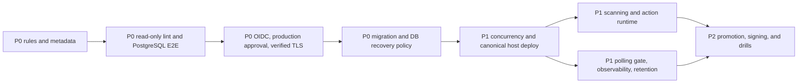

# CI/CD recommendations backlog

This backlog proposes future controls for `puente-radar-api`. It is deliberately separate from the [current-flow description](current-flow.md): none of the items below should be read as an existing protection or deployed capability.

## Priority model

| Priority | Meaning                                                                  |
| -------- | ------------------------------------------------------------------------ |
| P0       | Address before treating production delivery as repeatable and controlled |
| P1       | Add after the P0 release boundary is reliable                            |
| P2       | Improve provenance, recovery confidence, and long-term maintainability   |

Within a priority, sequence work to keep each PR reviewable. Roll controls into `staging` first, observe at least one successful delivery, and then apply them to `main` or `production`.

## P0: release safety and access control

| Recommendation                                                 | Problem and desired outcome                                                                                                                                                                      | Implementation direction                                                                                                                                                                                                                                                                                              | Acceptance evidence                                                                                                                                                                                                   | Risk and rollout notes                                                                                                                                                                       |
| -------------------------------------------------------------- | ------------------------------------------------------------------------------------------------------------------------------------------------------------------------------------------------ | --------------------------------------------------------------------------------------------------------------------------------------------------------------------------------------------------------------------------------------------------------------------------------------------------------------------- | --------------------------------------------------------------------------------------------------------------------------------------------------------------------------------------------------------------------- | -------------------------------------------------------------------------------------------------------------------------------------------------------------------------------------------- |
| **P0.1 Branch rulesets and required reviews/checks**           | Repository configuration does not prove that direct pushes or unchecked merges are blocked. Require reviewed, current, passing changes at both integration boundaries.                           | Create GitHub rulesets for `staging` and `main`; require pull requests, at least one approval, resolved conversations, and the exact CI check name. Restrict bypass and force-push permissions. Require `staging` as the normal path to `main` if that remains the release model.                                     | Exported ruleset configuration or screenshots; a test PR cannot merge with a failing/missing check or without approval; an unauthorized direct push is rejected.                                                      | Enable on `staging` first. Confirm check names on a real PR before making them required to avoid deadlocking merges. Document emergency bypass ownership and audit it after use.             |
| **P0.2 Versioned issue/PR templates and metadata validation**  | Issue-first labels exist, but contributors and automation cannot rely on repository-versioned structure or enforcement. Make the issue-to-PR link and approved status/type machine-checkable.    | Add issue forms, a PR template, and an `issues`/`pull_request` validation workflow. Require a linked approved issue and allowed status/type labels; use least-privilege permissions and fail with actionable messages. Define exceptions for dependency bots and emergency fixes.                                     | Template files are reviewed in-repo; representative valid and invalid issues/PRs produce expected checks; validation tests cover missing link, unapproved status, invalid type, and approved exception.               | Start in report-only mode, clean existing metadata, then make the check required. Avoid trusting editable PR body text alone when the API can verify links and labels.                       |
| **P0.3 PostgreSQL E2E and migration CI**                       | Unit tests do not prove database startup, migrations, or HTTP behavior against PostgreSQL. Prevent schema and runtime incompatibilities from reaching image publication.                         | Add a PostgreSQL service/container job. Create an empty database, run compiled or source migrations, start the app, execute `pnpm run test:e2e`, and optionally migrate from the last released schema fixture. Keep credentials ephemeral.                                                                            | CI logs show PostgreSQL readiness, migration success, application readiness, and E2E results; a deliberately broken migration and a failing HTTP scenario both block the PR.                                          | Keep the first suite focused to control runtime. Pin the PostgreSQL major version to production and avoid tests that depend on execution order or shared state.                              |
| **P0.4 Split lint check from lint fix**                        | The current CI lint command uses `eslint --fix`, so CI may alter its checkout instead of proving the submitted revision is clean. Make CI read-only and deterministic.                           | Change `lint` to a check-only command and add a separate `lint:fix` command for local use. Optionally add a formatting check that never writes.                                                                                                                                                                       | `pnpm run lint` leaves `git status --short` empty; a fixable lint violation fails CI; `pnpm run lint:fix` repairs the same fixture locally.                                                                           | This may expose previously auto-fixed violations. Land cleanup with the script split, then require the read-only check.                                                                      |
| **P0.5 AWS OIDC federation**                                   | Long-lived AWS access keys increase rotation and leakage risk. Give each job short-lived, attributable credentials.                                                                              | Create narrowly scoped IAM roles with GitHub OIDC trust conditions for repository, branch, event, and environment. Configure `aws-actions/configure-aws-credentials` with `role-to-assume`; remove access-key inputs and then delete stored keys after validation. Separate publish and deploy roles where practical. | Workflow logs show assumed-role identity and no access-key secrets; trust-policy tests reject an unapproved branch/repository; ECR and SSM operations still succeed with least privilege.                             | Run OIDC in parallel with current credentials for a staging proof, but do not leave an indefinite fallback. Scope `sub`/environment claims carefully to prevent arbitrary branch assumption. |
| **P0.6 Production environment approval**                       | A push to `main` can select `production`, but repository code cannot prove a human approval or production branch restriction exists. Add an explicit release decision after artifact validation. | Configure the GitHub `production` environment with required reviewers, no self-approval where supported, restricted deployment branches/tags, and protected environment secrets. Keep staging automatic. Add a preflight that validates the production instance target without printing it.                           | A test release pauses awaiting an authorized reviewer; rejection prevents SSM dispatch; an unapproved branch cannot use production secrets; the approval is visible in deployment history.                            | Verify production instance readiness before enabling. Define approver coverage and an audited emergency procedure so approval does not become an unsafe credential-sharing workaround.       |
| **P0.7 Verified RDS CA/TLS**                                   | `rejectUnauthorized: false` encrypts traffic but does not authenticate the PostgreSQL server certificate. Prevent man-in-the-middle acceptance and certificate surprises.                        | Install the current AWS RDS CA bundle in the image or mounted runtime configuration, pass the CA to both Nest runtime TypeORM and the CLI data source, and set `rejectUnauthorized: true`. Add certificate-expiry ownership.                                                                                          | Staging runtime, migrations, `/health`, and an E2E TLS test pass with the trusted CA; connection to an untrusted test certificate fails; the CA source/version and rotation date are documented.                      | Test against the actual RDS region and certificate chain. Roll out before CA expiry and preserve a controlled rollback path that does not silently disable verification.                     |
| **P0.8 Expand/contract migrations and database rollback plan** | Container rollback cannot reverse an already completed migration. Make every deployment safe for both old and new application versions and define recovery for data-affecting failures.          | Adopt expand/migrate/contract sequencing: add backward-compatible schema first, deploy dual-compatible code, backfill separately, and remove old schema only after the rollback window. Classify migrations, require backups/snapshots for destructive work, and document restore/recovery objectives and ownership.  | A migration checklist is required in PRs; compatibility tests run old application code against the expanded schema and new code before contraction; a staging restore exercise records measured RTO/RPO and commands. | Do not use automatic `migration:revert` as a universal rollback. Large backfills need throttling and observability; destructive contraction should be a later, separately approved release.  |

## P1: pipeline hardening and operations

| Recommendation                                            | Problem and desired outcome                                                                                                                                                                                                                                                                      | Implementation direction                                                                                                                                                                                                                                           | Acceptance evidence                                                                                                                                                                                                         | Risk and rollout notes                                                                                                                                                                          |
| --------------------------------------------------------- | ------------------------------------------------------------------------------------------------------------------------------------------------------------------------------------------------------------------------------------------------------------------------------------------------ | ------------------------------------------------------------------------------------------------------------------------------------------------------------------------------------------------------------------------------------------------------------------ | --------------------------------------------------------------------------------------------------------------------------------------------------------------------------------------------------------------------------- | ----------------------------------------------------------------------------------------------------------------------------------------------------------------------------------------------- |
| **P1.1 Deployment concurrency**                           | Two rapid pushes can dispatch overlapping migrations and container replacements to one environment. Serialize deployment state per environment and make supersession intentional.                                                                                                                | Add workflow/job `concurrency` keyed by environment. Prefer `cancel-in-progress: false` once deployment begins; optionally cancel only pre-deploy builds. Add a host-side lock around migration and replacement as defense in depth.                               | Two queued staging pushes produce one active deployment; the second waits or follows the documented supersession policy; no rollback-container collision occurs.                                                            | Canceling an active SSM command does not guarantee remote execution stops. Use a host lock and test interruption at migration, pull, and health-check phases.                                   |
| **P1.2 Remove user-data/deploy-script drift**             | `scripts/ec2-user-data.sh` embeds a deploy helper that already lacks the protected `/bridges` check present in the canonical script. Manual or first-boot behavior can diverge.                                                                                                                  | Make user data install or fetch one versioned canonical helper, or generate the embedded block from `scripts/ec2-deploy.sh` with a verification test. Prefer immutable instance provisioning over duplicated shell.                                                | CI compares embedded/generated content or proves only one implementation exists; a newly provisioned staging host performs the same migration, health, protected smoke, and rollback sequence as Actions.                   | Existing hosts are not changed by editing user data. Inventory and update them explicitly; never fetch executable code from an unpinned public location at boot.                                |
| **P1.3 Dependency, image scanning, and SBOM**             | The pipeline publishes an image without a recorded software bill of materials or vulnerability policy. Detect known vulnerable dependencies and base-image packages before release.                                                                                                              | Run lockfile and container scanning, generate CycloneDX or SPDX SBOMs, attach them to the workflow/artifact record, and set a severity/exception policy. Pin scanners and upload results as SARIF where appropriate.                                               | A known test vulnerability is reported; unwaived critical findings block publication; each image SHA has a downloadable SBOM and scan result; exceptions have owner and expiry.                                             | Seed the policy in report-only mode to baseline existing findings. Account for scanner outages, false positives, and private advisory access without making permanent blanket exceptions.       |
| **P1.4 Node action-runtime deprecation remediation**      | The verified successful run emitted a Node action-runtime deprecation warning. Avoid a future platform-forced runtime change breaking delivery unexpectedly.                                                                                                                                     | Inventory every action and version, update to releases that explicitly support GitHub's current action runtime, remove obsolete actions, and pin by full commit SHA where supply-chain policy requires it. Test on PR and push paths.                              | A fresh workflow run has no Node runtime deprecation warning; all actions resolve to supported versions; Dependabot or Renovate tracks future action updates.                                                               | Action upgrades can change inputs, outputs, cache behavior, or permissions. Update one action family at a time and inspect generated warnings and permissions.                                  |
| **P1.5 CBP polling authorization gate**                   | CBP refresh currently occurs through request-driven estimate reads behind the API-key guard. A future independent poller needs an explicit authorization and single-writer boundary so public traffic, retries, or duplicate schedulers cannot create uncontrolled upstream calls and snapshots. | Define one polling entry point with workload identity or a dedicated scoped secret, idempotency/lease protection, timeout and rate limits, and no public decorator. Separate refresh from read endpoints; restrict network and IAM access to the scheduler.        | Unauthorized calls return `401/403` and do not contact CBP or write snapshots; authorized calls produce one fetch cycle; concurrent invocations elect one writer; audit logs identify caller and result without secrets.    | Confirm CBP usage terms and permitted cadence before automation. Stage with low frequency and a kill switch; preserve stale-data fallback when CBP is unavailable.                              |
| **P1.6 Historical collector observability and retention** | Snapshot history can grow without an explicit retention/SLO control, while a read-only audit command alone does not alert on collector gaps or bias. Make collection health and storage cost observable.                                                                                         | Emit structured metrics for fetch success, latency, freshness, rows written, duplicates, missing lanes, null delays, and last successful collection. Alert on SLO breaches. Define hot retention, archival/export, deletion, indexes, and audit-report scheduling. | Dashboards and alerts detect a forced collector failure and stale series; retention removes or archives only eligible rows in staging; restore/query tests prove retained history remains usable; table growth is forecast. | Choose retention from product/statistical requirements before deletion. Backfill and cleanup in bounded batches, monitor locks/I/O, and preserve timezone and provenance semantics in archives. |

## P2: provenance and recovery maturity

| Recommendation                                         | Problem and desired outcome                                                                                                                                                 | Implementation direction                                                                                                                                                                                                  | Acceptance evidence                                                                                                                                    | Risk and rollout notes                                                                                                                 |
| ------------------------------------------------------ | --------------------------------------------------------------------------------------------------------------------------------------------------------------------------- | ------------------------------------------------------------------------------------------------------------------------------------------------------------------------------------------------------------------------- | ------------------------------------------------------------------------------------------------------------------------------------------------------ | -------------------------------------------------------------------------------------------------------------------------------------- |
| **P2.1 Promote one verified image**                    | Separate branch pushes rebuild source, so production may not run the exact image already exercised in staging. Promote a digest rather than rebuilding release content.     | Record the staging image digest, approve it, and retag or deploy that digest to production. Include commit, workflow run, and source repository labels/attestations.                                                      | Staging and production deployment records show the same image digest; provenance resolves the digest to the reviewed commit and workflow.              | Environment-specific configuration must remain runtime-only. Validate registry retention so promotion cannot reference a pruned image. |
| **P2.2 Deployment attestations and signing**           | Branch/SHA tags identify source but do not cryptographically prove who built an image or which workflow produced it. Add verifiable provenance.                             | Use keyless OIDC-backed signing and SLSA-compatible provenance for image digests; verify before EC2 runs the image. Store policy and verification tooling in version control.                                             | Tampered or unsigned test images are rejected; valid images verify repository, workflow, commit, and builder identity; verification events are logged. | Introduce verification in audit mode first. Plan trust-root rotation and a controlled break-glass path that remains attributable.      |
| **P2.3 Recovery and rollback drills**                  | Shell logic alone does not prove recovery under disk pressure, SSM interruption, bad migrations, or failed container restore. Turn rollback claims into rehearsed evidence. | Schedule staging game days covering failed health checks, stale rollback containers, unavailable ECR/SSM, database restore, and host replacement from user data or infrastructure code. Record owners and recovery times. | A dated drill report demonstrates each scenario, measured RTO/RPO, observed alerts, and closed follow-up actions.                                      | Use synthetic or sanitized data and explicit stop conditions. Never test destructive recovery first in production.                     |
| **P2.4 Documentation and workflow conformance checks** | CI/CD documentation can drift from triggers, script names, and duplicated host setup. Keep operational guidance reviewable with the code it describes.                      | Add non-mutating Markdown lint/link checks and targeted tests for documented command names, image-tag format, environment mapping, and canonical deploy-helper use. Assign code owners for delivery files.                | CI fails on a broken repository link or stale asserted command; delivery changes include documentation review; checks run without rewriting files.     | Test stable contracts rather than exact prose to avoid brittle documentation tests. Start with links and duplicated-script detection.  |

## Suggested sequence

The first milestone is not “more automation”; it is a controlled merge and release boundary with read-only checks, database evidence, short-lived credentials, verified TLS, and a rollback-compatible schema policy. Later work can then add supply-chain provenance and operational maturity without masking foundational gaps.
