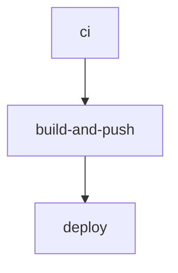
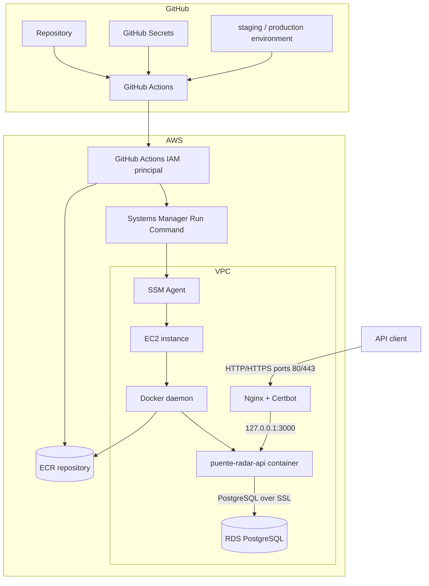
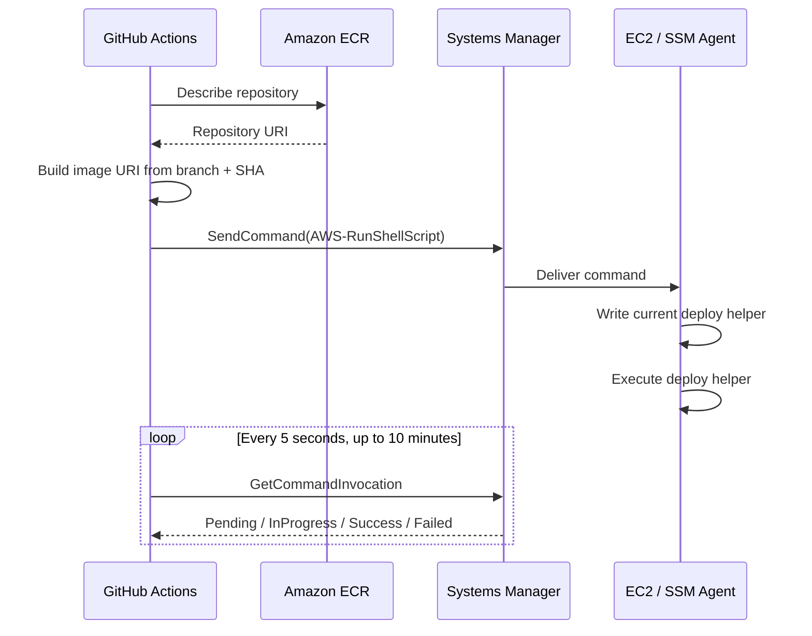
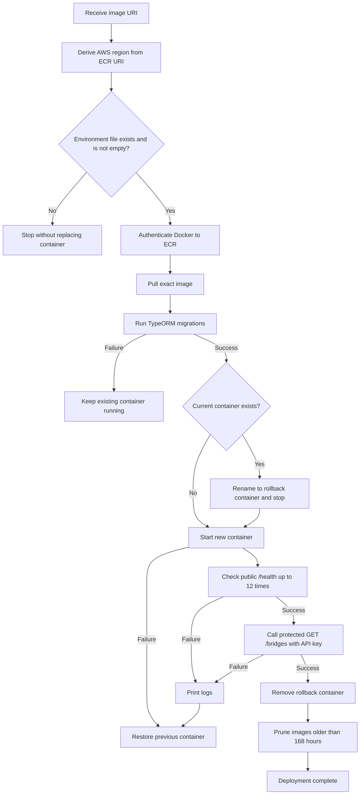

# Puente Radar API delivery workflow

This document explains how source code moves from a Git push to a healthy container on Amazon EC2. The pipeline validates the NestJS application, publishes an immutable Docker image to Amazon ECR, and deploys it through AWS Systems Manager. Nginx terminates public HTTP/HTTPS traffic for `api.puenteradar.com` and proxies to an API container bound only to EC2 loopback.

## Quick path

1. A developer pushes a commit to `staging` or `main`.
2. GitHub Actions runs lint, build, and unit tests.
3. On push events, the pipeline builds and publishes a Docker image to ECR.
4. GitHub Actions sends an SSM Run Command to the target EC2 instance.
5. EC2 authenticates to ECR, pulls the exact image, and runs TypeORM migrations.
6. The deployment helper replaces the application container on `127.0.0.1:3000`, validates public `/health`, and calls protected `GET /bridges` with the configured API key inside it.
7. Nginx serves public ports 80/443 and forwards requests to the private container binding.
8. If startup, health, or protected-endpoint validation fails, the previous application container is restored.

## End-to-end pipeline

```mermaid
flowchart LR
    Developer[Developer] -->|push or pull request| GitHub[GitHub repository]
    GitHub --> CI[CI job]
    CI --> Lint[Lint]
    Lint --> Build[Build]
    Build --> Tests[Unit tests]

    Tests -->|pull request| Complete[Validation complete]
    Tests -->|push| Docker[Build Docker image]
    Docker --> ECR[(Amazon ECR)]
    ECR --> Deploy[Deploy job]
    Deploy -->|SSM SendCommand| SSM[AWS Systems Manager]
    SSM --> EC2[Amazon EC2]
    EC2 -->|pull exact image| ECR
    EC2 -->|TLS connection| RDS[(Amazon RDS PostgreSQL)]
    EC2 --> Health[Public health check]
    Health --> Auth[Protected API-key check]
    Auth -->|healthy| Live[Deployment complete]
    Health -->|unhealthy| Rollback[Restore previous container]
    Auth -->|unauthorized or unhealthy| Rollback
```



### Event behavior

| Event | Branch | CI | Docker push | EC2 deploy |
|---|---|---:|---:|---:|
| Pull request | `staging` or `main` | Yes | No | No |
| Push | `staging` | Yes | Yes | Yes, staging environment |
| Push | `main` | Yes | Yes | Yes, production environment |

The jobs are sequential:



`build-and-push` cannot run unless `ci` succeeds. `deploy` cannot run unless the image is successfully published.

## Infrastructure architecture



## Stage 1: continuous integration

Source: `.github/workflows/ci-cd.yml`, job `ci`.

The CI job runs on `ubuntu-latest` and performs these steps:

1. Checks out the exact candidate commit.
2. Installs pnpm 9.
3. Installs Node.js 20 with pnpm caching.
4. Runs `pnpm install --frozen-lockfile`.
5. Runs `pnpm run lint`.
6. Runs `pnpm run build`.
7. Runs `pnpm run test --ci --coverage=false`.

The frozen lockfile guarantees that CI uses dependency versions recorded in `pnpm-lock.yaml`. A failure in any command stops the workflow before an image can be published.

> E2E tests are not part of this job because they require PostgreSQL. The current CI gate covers linting, compilation, and unit behavior.

## Stage 2: build and publish the image

Source: `.github/workflows/ci-cd.yml`, job `build-and-push`.

This job runs only for push events. It authenticates to AWS and ECR, then builds and publishes the production Docker image.

### Image identity

The image tag is deterministic and immutable for the commit:

```text
<branch>-<full-git-sha>
```

Example:

```text
staging-4d263f9...
```

The complete image URI follows this format:

```text
<aws-account>.dkr.ecr.<region>.amazonaws.com/<repository>:<branch>-<sha>
```

This avoids deploying an ambiguous mutable tag such as `latest`. The deploy job reconstructs the exact URI by querying ECR for the repository URI and appending the same branch/SHA tag.

## Stage 3: dispatch through Systems Manager

Source: `.github/workflows/ci-cd.yml`, job `deploy`.

The deploy job uses AWS Systems Manager instead of SSH from GitHub Actions.

### Why SSM

- GitHub-hosted runner IP addresses do not need access to port 22.
- The EC2 security group can keep SSH restricted to the maintainer's IP.
- The GitHub IAM principal can be limited to one EC2 instance and `AWS-RunShellScript`.
- AWS records command identifiers, status, output, and errors.
- No private SSH key is needed by the workflow.

### Script synchronization

The deploy job checks out the repository and base64-encodes `scripts/ec2-deploy.sh`. The SSM command writes that exact version to `/home/ec2-user/deploy.sh` before execution.

This prevents drift between the repository and an old helper created when EC2 first ran `scripts/ec2-user-data.sh`.

### Command lifecycle



GitHub Actions polls the command for up to 120 attempts with a five-second delay. A terminal status other than `Success` prints the remote standard output and standard error and fails the job.

## Stage 4: EC2 deployment transaction

Source: `scripts/ec2-deploy.sh`.

The helper runs with `set -euo pipefail`; unexpected command failures, undefined variables, and pipeline failures stop the deployment.



### ECR authentication

The helper extracts the AWS region from the registry hostname when a region argument is not supplied. This ensures that the ECR authorization token and target registry use the same region.

### Database migrations

Before replacing the application container, the helper runs:

```bash
docker run --rm \
  --env-file /home/ec2-user/puente-radar.env \
  <image-uri> \
  pnpm run migration:run:prod
```

If migrations fail, the currently running API container remains untouched.

RDS connections use `DATABASE_SSL=true`. The current TypeORM configuration enables TLS with `rejectUnauthorized: false`. For stronger production verification, install the AWS RDS CA bundle and switch to certificate validation.

### Container replacement

The active container is named:

```text
puente-radar-api
```

During replacement, the old container is temporarily renamed:

```text
puente-radar-api-rollback
```

The new container starts with:

- Restart policy: `unless-stopped`
- Host binding: `127.0.0.1:3000`
- Container port: `3000`
- Environment file: `/home/ec2-user/puente-radar.env`

Docker does not publish the application on a public interface. Nginx is the only public HTTP boundary and proxies requests to `http://127.0.0.1:3000`.

### Deployment validation

The helper first checks the public readiness endpoint from inside the container:

```text
http://127.0.0.1:3000/health
```

It tries 12 times with five seconds between attempts. After readiness succeeds, the helper reads `ADMIN_API_KEY` only from the container environment and calls protected `GET /bridges` with `x-api-key`. The key is never printed. The rollback container is removed only after both checks pass. A readiness failure prints the latest 100 application log lines; a missing key or protected-check failure emits only a generic error. Either failure restores the old container.

## Rollback boundaries

| Failure point | Result |
|---|---|
| CI, tests, Docker build, or ECR push | EC2 is not touched |
| SSM dispatch failure | Existing container remains running |
| ECR authentication or image pull failure | Existing container remains running |
| Database migration failure | Existing container remains running |
| New container startup failure | Previous container is restored |
| Health check failure | New container is removed and previous container is restored |
| Protected API-key check failure | New container is removed and previous container is restored |
| Backup cleanup failure | Deployment may require manual inspection before the next rollout |

> Database migrations are not automatically rolled back. Production migrations must remain backward-compatible with the previously deployed application image.

> During the one-time cutover, there is a short public interruption after the first successful private-binding deployment and before Nginx starts. Automatic application rollback still works if startup or health validation fails, but it does not roll back Nginx, certificates, security-group rules, or a completed migration. After the first private deployment succeeds and removes the old public-binding container, reverting the network architecture requires an explicit operator action.

## Configuration and permissions

### GitHub secrets

| Secret | Purpose |
|---|---|
| `AWS_ACCESS_KEY_ID` | Authenticates the GitHub Actions AWS principal |
| `AWS_SECRET_ACCESS_KEY` | Secret for the GitHub Actions AWS principal |
| `AWS_REGION` | Region containing ECR, EC2, and SSM resources |
| `ECR_REPOSITORY` | ECR repository name |
| `EC2_INSTANCE_ID_STAGING` | Staging managed-node target |
| `EC2_INSTANCE_ID_PROD` | Production managed-node target when production exists |

The current workflow uses static AWS access keys. A recommended future hardening step is replacing them with GitHub OIDC and an assumable IAM role.

### GitHub Actions IAM permissions

The GitHub principal needs:

- ECR permissions to authenticate, build metadata queries, and push image layers.
- `ssm:SendCommand` scoped to the target EC2 instance and `AWS-RunShellScript`.
- `ssm:GetCommandInvocation` to poll and retrieve the result.

### EC2 instance role

The EC2 role needs:

- `AmazonEC2ContainerRegistryReadOnly` to authenticate and pull from ECR.
- `AmazonSSMManagedEC2InstanceDefaultPolicy` or equivalent least-privilege SSM managed-node permissions.

### EC2 runtime environment

`/home/ec2-user/puente-radar.env` contains application runtime values and must have restrictive permissions.

Required database settings include:

```env
DATABASE_HOST=<rds-endpoint>
DATABASE_PORT=5432
DATABASE_USER=<rds-user>
DATABASE_PASSWORD=<rds-password>
DATABASE_NAME=puente_radar
DATABASE_SSL=true
DATABASE_SYNC=false
DATABASE_LOGGING=false
ADMIN_API_KEY=<generated with openssl rand -hex 32>
```

`ADMIN_API_KEY` is required in production and must contain at least 32 non-whitespace characters. Only `GET /health` and `POST /reports` are public; all other API routes require its exact configured value in `x-api-key`. Do not commit this file or print its contents in CI logs.

### Historical collection variables (HBTR feature)

The scheduled CBP collector and the historical-patterns endpoint are **off by default**; enable them only with these variables in the same env file. All have safe defaults, so adding none of them is valid:

```env
# Timezone for local grouping (default America/Ciudad_Juarez)
HISTORICAL_TZ=America/Ciudad_Juarez
# Scheduled collection every HISTORICAL_CADENCE_MINUTES via cron (default "false")
HISTORICAL_COLLECTION_ENABLED=false
# Exposes GET /historical-patterns (default "false")
HISTORICAL_API_ENABLED=false
# Cadence for slot bucketing (default 15; cron remains fixed at 15 minutes)
HISTORICAL_CADENCE_MINUTES=15
# Minimum comparable local dates for sufficient evidence (default 6)
HISTORICAL_MIN_DATES=6
# Minimum coverage ratio for sufficient evidence (default 0.7)
HISTORICAL_MIN_COVERAGE_RATIO=0.7
```

> **Production gate:** `HISTORICAL_COLLECTION_ENABLED=true` polls the undocumented CBP JSON endpoint on a fixed cadence. Do not enable it in production until the crossing-direction and polling-rate/ToS confirmation from the PR1 audit is obtained. `HISTORICAL_API_ENABLED=true` alone is safe; without collected slots the endpoint returns `insufficientData`.

> **Applying changes:** the running container only reads this env file at start. After editing the file, recreate the container (`docker rm -f puente-radar-api && docker run ...` per `scripts/ec2-deploy.sh`) or trigger a fresh deployment through the CI/CD pipeline.

## Network boundaries

| Connection | Direction | Port | Rule |
|---|---|---:|---|
| Client to Nginx | Inbound to EC2 | 80 | Public; Certbot challenge and HTTP-to-HTTPS redirect after certificate setup |
| Client to Nginx | Inbound to EC2 | 443 | Public HTTPS endpoint |
| Nginx to API container | EC2 loopback | 3000 | Bound only to `127.0.0.1`; never allowed by the security group |
| Maintainer SSH | Inbound to EC2 | 22 | Restricted to maintainer IP only |
| EC2 to RDS | Outbound from EC2 / inbound to RDS | 5432 | RDS allows the EC2 security group only |
| EC2 to AWS APIs | Outbound from EC2 | 443 | Required for SSM and ECR |
| GitHub Actions to AWS APIs | Outbound from runner | 443 | Uses IAM credentials; no inbound EC2 access |

## One-time Nginx and TLS cutover

Perform these steps in order so Nginx never claims port 80 while the old public Docker binding is active:

1. Allow inbound TCP 443 in the EC2 security group. Keep port 80 open for the Let's Encrypt HTTP-01 challenge and redirect.
2. From a repository checkout, upload the proxy configuration over the maintainer's restricted SSH path:

   ```bash
   scp scripts/nginx-puente-radar.conf ec2-user@<ec2-elastic-ip>:/tmp/puente-radar.conf
   ```

3. On EC2, install Nginx, Certbot, and the Nginx plugin without starting Nginx:

   ```bash
   sudo dnf install -y nginx certbot python3-certbot-nginx
   sudo systemctl disable --now nginx
   sudo install -m 0644 /tmp/puente-radar.conf /etc/nginx/conf.d/puente-radar.conf
   sudo nginx -t
   ```

4. Deploy the repository version that publishes Docker on `127.0.0.1:3000`. Confirm `curl -i http://127.0.0.1:3000/health` returns HTTP `200`.
5. Start Nginx only after the private API binding is healthy:

   ```bash
   sudo systemctl enable --now nginx
   curl -i http://api.puenteradar.com/health
   ```

6. Issue the certificate and let Certbot add the managed TLS and redirect directives:

   ```bash
   sudo certbot --nginx -d api.puenteradar.com --redirect
   curl -i https://api.puenteradar.com/health
   sudo certbot renew --dry-run
   ```

7. Verify the installed Certbot renewal timer with `systemctl list-timers --all | grep certbot`. If the package did not install one, configure a root-owned systemd timer or cron job that runs `certbot renew`.

`scripts/ec2-user-data.sh` installs the same packages and writes the same initial proxy for future Amazon Linux 2023 hosts, but deliberately leaves Nginx disabled and inactive. The API must be deployed and healthy before an operator enables Nginx and requests a certificate.

## Post-deploy validation

### On EC2

```bash
docker ps --filter name=puente-radar-api
curl -i http://127.0.0.1:3000/health
docker exec puente-radar-api node -e "const key=process.env.ADMIN_API_KEY;if(!key)process.exit(1);fetch('http://127.0.0.1:3000/bridges',{headers:{'x-api-key':key}}).then(r=>process.exit(r.ok?0:1)).catch(()=>process.exit(1))"
curl -i -H 'Host: api.puenteradar.com' http://127.0.0.1/health
sudo nginx -t
sudo certbot certificates
```

Expected results:

- The container is `Up`.
- Both direct loopback and Nginx-proxied `/health` requests return HTTP `200`.
- The protected endpoint check exits successfully without printing the key.
- The health payload reports the database as available.
- The certificate covers `api.puenteradar.com` and is not near expiry.

### From a maintainer workstation

```bash
curl -i https://api.puenteradar.com/health
```

This validates DNS, the EC2 security group, Nginx TLS termination, the loopback proxy, the API process, and the RDS connection.

### Failure diagnostics

```bash
docker logs --tail 100 puente-radar-api
```

## Troubleshooting map

| Symptom | Cause | Resolution |
|---|---|---|
| pnpm reports no tests | Jest flags were passed after a literal `--` | Use `pnpm run test --ci --coverage=false` |
| Docker build reports user `node` already exists | The Node base image already includes that user | Reuse the built-in `node` user |
| GitHub SSH deploy times out | Port 22 is restricted to the maintainer's IP | Use SSM Run Command instead of GitHub-to-EC2 SSH |
| AWS CLI cannot parse `--parameters` | A multi-word command was sent with shorthand syntax | Serialize `commands` as a JSON StringList |
| SSM helper receives no arguments | Remote shell argument boundaries were lost | Use explicit positional arguments or sync the helper and pass one quoted image URI |
| Required image URI is empty | Cross-job output was unavailable at runtime | Query ECR and reconstruct the deterministic branch/SHA tag |
| `SendCommand` rejects the comment | SSM comments have a 100-character limit | Use the short image tag, not the full URI |
| ECR login returns HTTP 400 | Authorization token and registry region differ | Derive the region from the ECR registry URI |
| PostgreSQL reports `no encryption` | RDS requires SSL | Set `DATABASE_SSL=true` and enable TypeORM SSL |
| Health check fails | API startup or RDS connectivity failed | Inspect container logs; the helper restores the old container |
| Protected endpoint check fails | `ADMIN_API_KEY` is missing, mismatched, or the protected route is unhealthy | Correct the container environment; the helper restores the old container without printing the key |

## Operational checklist

### Before deployment

- [ ] CI passes on the candidate commit.
- [ ] Required GitHub secrets exist for the target environment.
- [ ] The EC2 instance appears Online in Systems Manager.
- [ ] `/home/ec2-user/puente-radar.env` exists and is not empty.
- [ ] The EC2 role can pull from ECR.
- [ ] The RDS security group permits PostgreSQL from the EC2 security group.
- [ ] `DATABASE_SSL=true` is configured for RDS.
- [ ] `ADMIN_API_KEY` is configured with at least 32 non-whitespace characters.
- [ ] Historical flags are set intentionally: `HISTORICAL_COLLECTION_ENABLED=true` only after the external CBP audit gate approves polling; `HISTORICAL_API_ENABLED=true` when the endpoint should be public.
- [ ] Nginx configuration passes `sudo nginx -t`.
- [ ] EC2 security-group ports 80 and 443 are public; port 3000 is not public.

### After deployment

- [ ] GitHub Actions shows all three jobs as successful.
- [ ] `puente-radar-api` is running on EC2.
- [ ] Internal `/health` returns HTTP `200`.
- [ ] Internal protected `GET /bridges` succeeds with the configured API key.
- [ ] Public HTTPS `/health` returns HTTP `200` with a valid certificate.
- [ ] `sudo certbot renew --dry-run` succeeds and automated renewal is scheduled.
- [ ] No stale `puente-radar-api-rollback` container remains.
- [ ] Application logs contain no startup or database errors.

## Source of truth

| File | Responsibility |
|---|---|
| `.github/workflows/ci-cd.yml` | CI, image publication, SSM dispatch, and command polling |
| `Dockerfile` | Production application image |
| `scripts/ec2-deploy.sh` | Migration-safe EC2 rollout, public and protected smoke checks, and rollback |
| `scripts/nginx-puente-radar.conf` | Canonical initial HTTP reverse proxy; Certbot manages the EC2 TLS additions |
| `scripts/ec2-user-data.sh` | First-boot EC2 setup, including an inactive embedded copy that must stay aligned with the canonical proxy |
| `src/config/typeorm.config.ts` | Runtime TypeORM configuration, including optional SSL |
| `src/database/data-source.ts` | TypeORM CLI migration configuration |
| `README.md` | Setup commands, environment variables, and AWS prerequisites |
